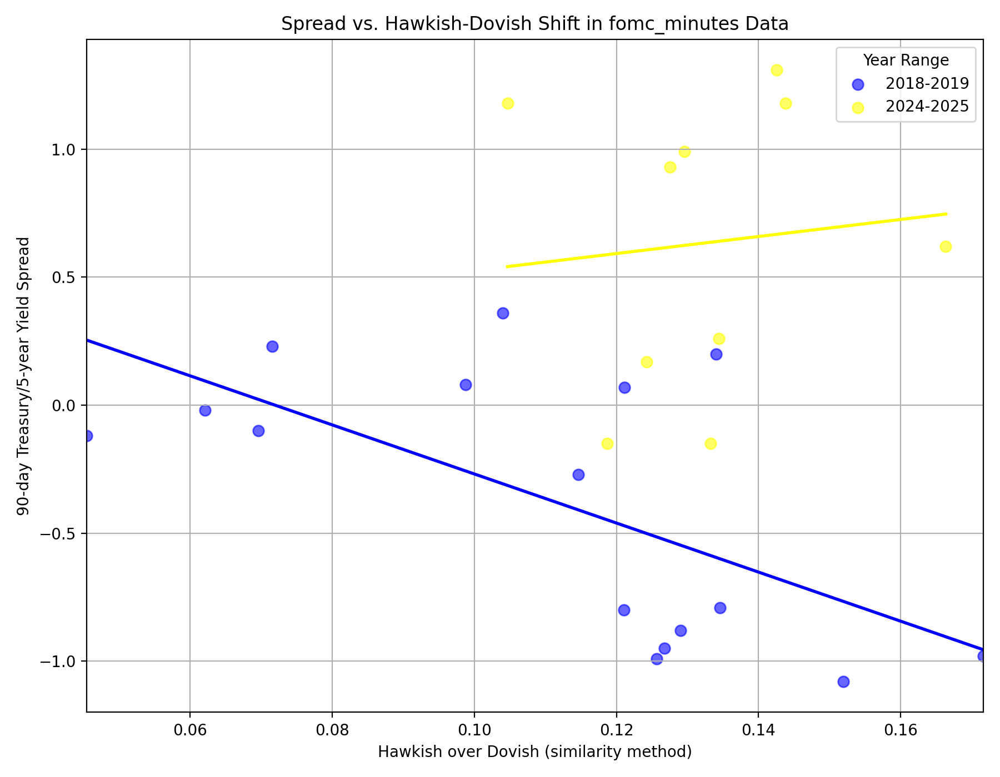

# Assignment #2: Evaluating Hawkishness and Dovishness of FOMC Communication

Yulin Song

## Intro

In this project we adopt several NLP techniques to evaluating Hawkishness and Dovishness of FOMC statements, and use linear regression to evaluate its correlation with 90-day Treasury/5-year yield spread.

## Data collection

I collected FOMC Meeting Minutes, Fed speeches and Press Conference transcripts during the 2018 to 2019 period and 2024 to 2025 period through web crawling and data cleaning. 

## Evaluation using NLP techniques

To compare the effectiveness of different methods discussed in class, I select the 2 below:

- **Similarity-based method using "ProsusAI/finbert" model.** 

I splited the corpus into sentences and encode them with finbert model. Then, I asked chatgpt to generate some typical dovish statements and hawkish statements, which are also encoded using finbert model, and are averaged and reference embeddings. Next, I compute the similarity between each sentence and them, to calculate the Hawkishness and Dovishness of the sentences, which is a 2-dim vector. By aggregating Hawkishness and Dovishness vector of all sentences in a document to a single vector, I get the vector that is then treated as input to the linearing regression model. 

- **Classification method using "gtfintechlab/FOMC-RoBERTa", which is a finetuned model.**

The data processing process is similar, but this time the model directly output a 3-dim vector respect to dovishness, hawkishness, and neutrality. By aggregating them, I get the Hawkishness and Dovishness vector of all documents. As the output is softmaxed, which means all sum to 1, I only use Hawkishness and Dovishness score as the input to the linearing regression model.

I didn't choose to use word dictionary and tf-idf method because: 1) Using only word without context is not accurate enough; 2) I couldn't find a good hawkish / dovish dictionary online and the  dictionary I tried to collect with the help of LLM(chatgpt, grok) is not good enough.

## Regression and Evaluation

#### Classification method

Across all three sources of fomc statements—minutes, press conferences, and speeches—the 2018–19 period shows a consistent, strong negative correlation: hawkish communication almost always led to curve flattening (i.e. a lower 90 day/5 year spread).

In 2024–25, the communication-to-spread transmission appears to be dampened: it’s still present (weakly) for minutes, nearly gone for press conferences, and very slight for speeches.

The data may suggest that markets may now be more focused on actual data and policy outcomes than on Fed “tone,” or perhaps they’re pricing in a baseline expectation of tightening such that extra hawkish language moves the needle far less. Either way, the predictive power of hawk/dove language for yield-curve moves has clearly diminished in current days.

#### Similarity-based method

For 2018–2019: All three data sources(minutes, press‐conference Q&A, speeches) showed either negative slope or moderate flattening (negative correlation) when tone went hawkish. The more data there is, the more negative correlation between hawkishness and spread. 

For 2024–25:

- Minutes & press conferences statements have actually reversed into a positive relationship (steepening).
- Speeches still carry a weak negative signal but it’s almost flatten.

The similarity method shows the same trend: markets are not so sensitive to the hawishness over dovishness recently. the predictive power of hawk/dove language for yield-curve moves has clearly diminished in current days.

#### Comparison between different methods:

By mannual inspecting the dovishness and hawkishness of sentences, I found that classification method performs significantly better than the similarity based method. The notions of *dovishness* and *hawkishness* are inherently broad and nuanced, making it difficult to define clear-cut representative expressions. As a result, it is challenging to analyze these tendencies effectively through similarity comparisons. I also experimented with directly computing the similarity between sentences and simple references like "This sentence is hawkish" and "This sentence is dovish," but the results were even less meaningful—suggesting that FinBERT may struggle to encode the semantic essence of *hawkish* and *dovish* into meaningful embeddings.